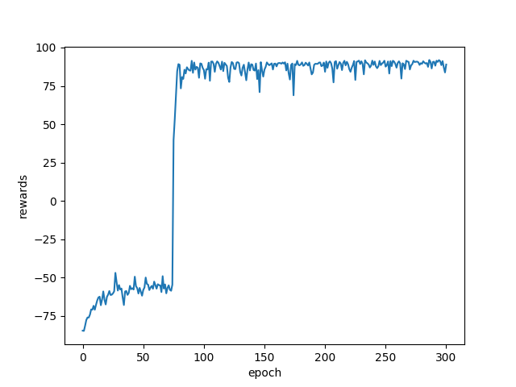
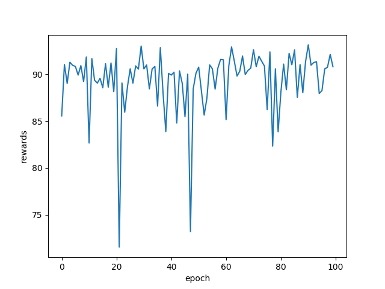
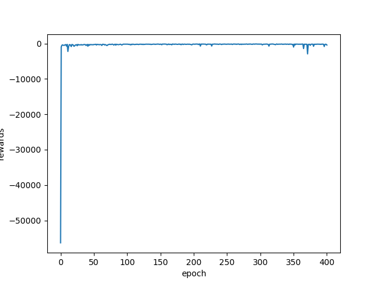
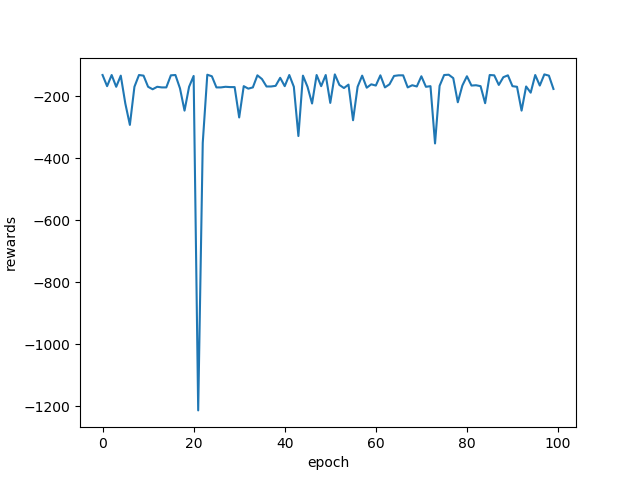

# MountainCar-Continuous-
Solution for MountainCar and MountainCarContinuous problems, using q-learning algorithm.  
#### Usage  
car.py {Task_that_you_want_to_solve Continuous or Discrete one} 
#### Visualization
General result for Continuous task looks like this:  
  
The average reward after training is higher than 90.  

General result for Discrete task looks like this:  
  
The average reward after training is higher than -200.  

